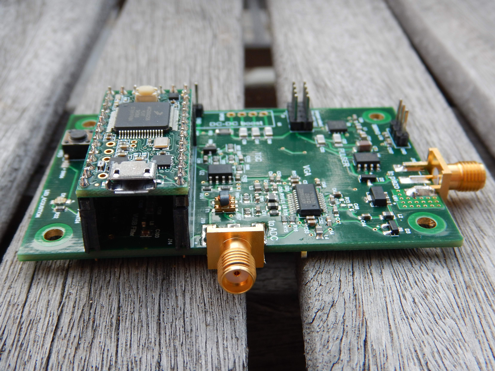
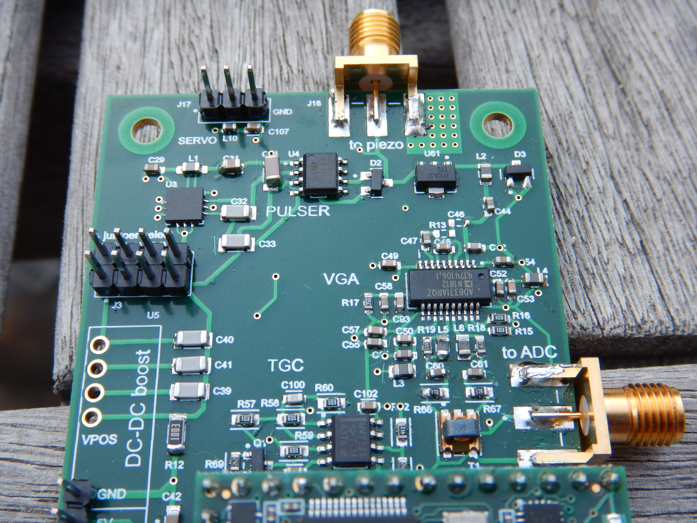
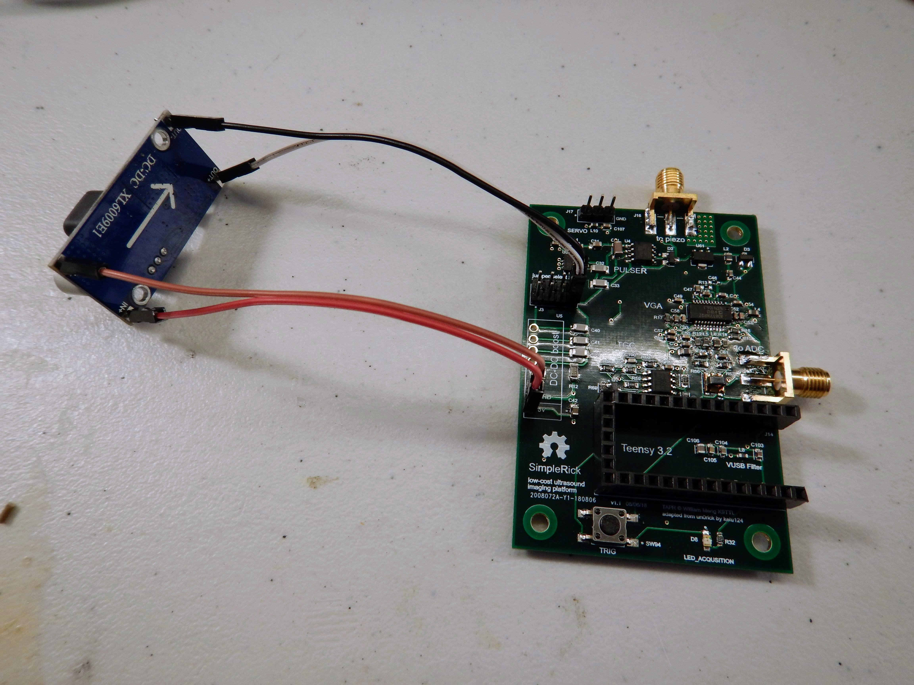
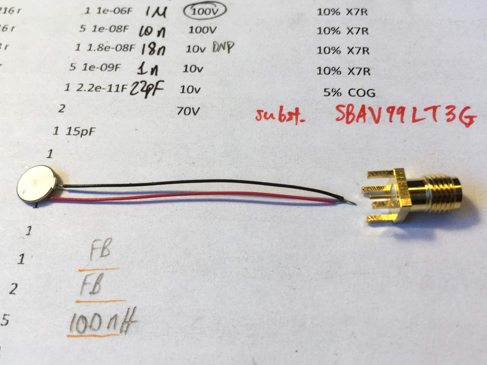
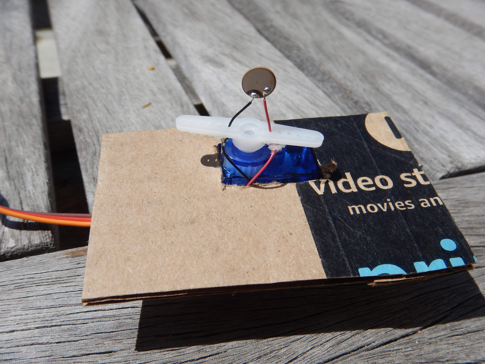
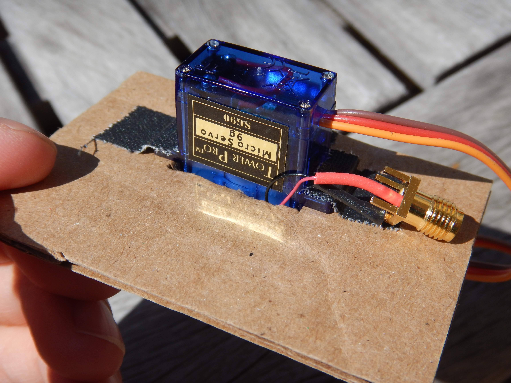
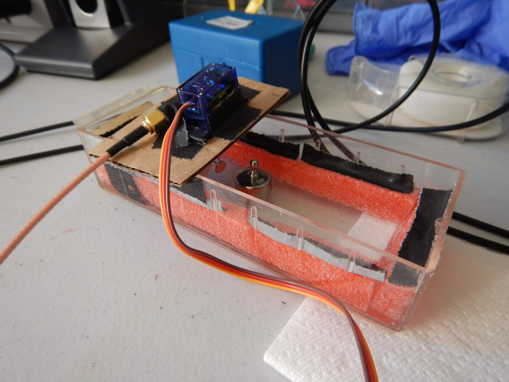
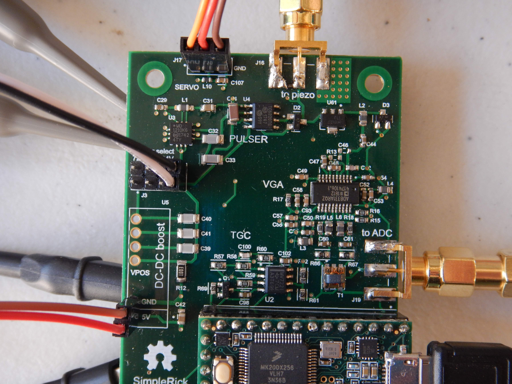
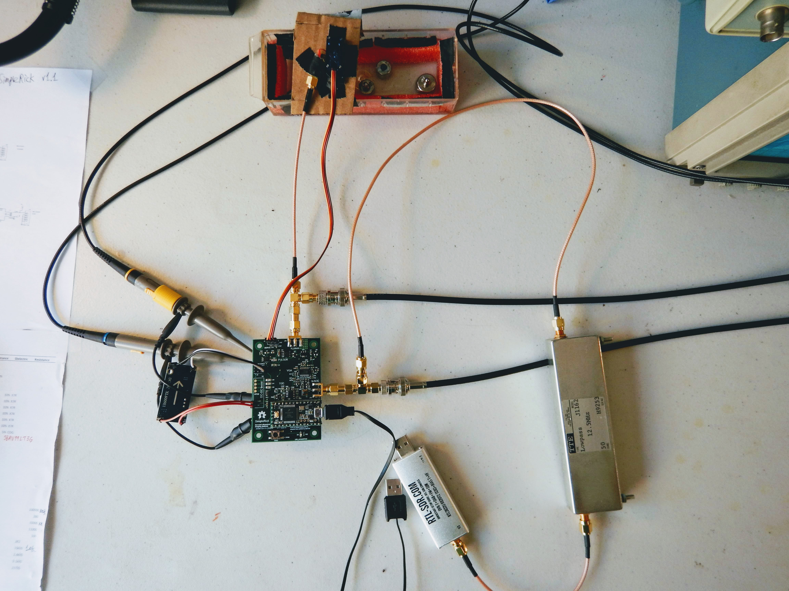
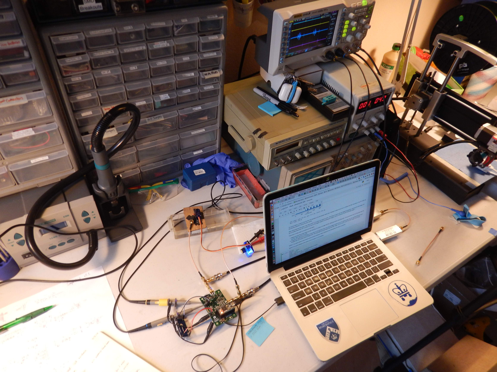

# SimpleRick PCB v1.1

| Field        | Value        |
|--------------|--------------|
| Version      | 1.1          |
| Author       | William Meng |
| Date         | 08/06/18     |
| Designed in  | Upverter     |
| License      | TAPR OHL     |
| Dimensions   | 2"x3"        |
| Layers       | 4            |
| Manufacturer | JLC PCB      |

## BOM
See [BOM spreadsheet](SimpleRick_BOM_v1.1.xlsx) listing all components to be soldered to the board.

### Additional hardware
#### Minimal setup
* STEMiNC [SMD07T05R412WL](https://www.steminc.com/PZT/en/disc-7x05mm-r-wire-leads-4-mhz) piezo
* [Teensy 3.2](https://www.amazon.com/dp/B015M3K5NG/)
* micro USB cable
* header pins
* jumper wires, M-F
* [XL6009 Boost Converter module](https://www.amazon.com/eBoot-Converter-Voltage-Adjustable-Step-up/dp/B06XWSV89D/)
* [SG90 micro servo motor](https://www.amazon.com/Micro-Helicopter-Airplane-Remote-Control/dp/B072V529YD/)
* [SMA cables](https://www.amazon.com/DZS-Elec-Connecting-Coaxial-Extender/dp/B072FS4WMK/)
* 12.5 MHz low pass filter
* [RTL-SDR v3](https://www.amazon.com/RTL-SDR-Blog-RTL2832U-Software-Defined/dp/B0129EBDS2/)
* computer with USB ports

#### Setup for debugging
* SMA splitter
* SMA to BNC adapter
* BNC cables
* oscilloscope with probes

## Assembly Instructions
1. Use stencil to apply solder paste.
2. Pick and place SMD components.
3. Reflow.
4. Manually solder through hole components.
5. (optional) Solder test points to pads on back.
5. Solder header pins to Teensy, then attach it to header pins on SimpleRick. 
6. Solder jumper wires to boost converter, then attach it to header pins on SimpleRick.
7. Solder female SMA connector to piezo, then connect it to SimpleRick with SMA cable.
8. Attach piezo to servo motor however you like. I used hot glue.

## Usage
1. Flash SimpleRick firmware to Teensy.
2. Connect RTL-SDR and low pass filter with SMA cables.
3. Follow instructions for using rtl-ultrasound software.

## Photos
#### Unassembled
Rendering by OSH Park

Bare PCB, front and back

#### Assembled
Assembled PCB, front

Assembled PCB, test points on back

Side view

Another side view

Close up of analog circuits

#### Setup
Connecting XL6009 boost converter to VPOS and GND

Solder piezo to female SMA connector

Attaching piezo to motor

Anechoic chamber

Making the connections

## Next Steps
Fix errata in PCB layout:

* swapped labels for V_PIEZO and GND testpoints
* LED\_ACQUISITION should say LED\_PWR
* some silkscreen labels are cutoff by vias
* GND testpoint for V\_GAIN is inconveniently placed too close to V\_GAIN testpoint

Other things to be improved:

* high current traces should be wider
* add bleeder resistor between V_PIEZO and GND
* insufficient decoupling for servo motor
* separate AGND and DGND planes
* reduce usage of high value MLCC due to supply shortage
* use larger components for VUSB filter
* get premade connectors for attaching Teensy
* LEDs for: 5V, 3.3V, acquisition
* servo power rail needs more decoupling
* make silkscreen info (author, license, version, etc) more readable... consider moving it to back